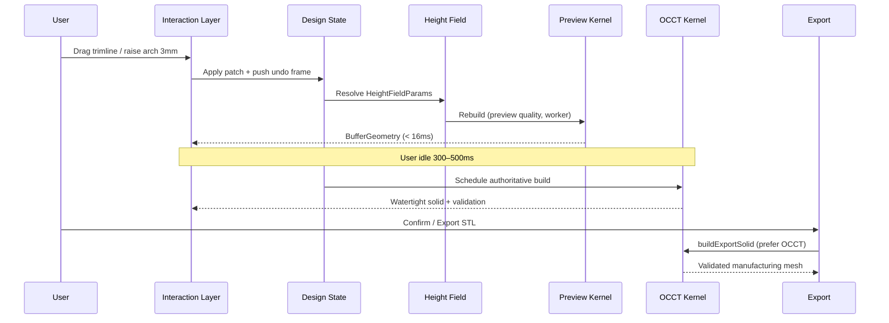

# Orthotic Insole CAD — System Architecture

**Status:** Architecture specification (v1.0)  
**Audience:** Engineering, clinical product, manufacturing  
**Platform:** Vertex (web orthotic CAD) on Chili3D (browser OCCT B-rep kernel)

This document defines the target architecture for a modern web-based orthotic insole CAD system that replaces legacy Rhino workflows. It unifies **direct / freeform editing** and **automated clinical corrections** on the same geometry, producing watertight output suitable for 3D printing and CNC milling.

Related implementation docs:

- [`hybrid-geometry-architecture.md`](./hybrid-geometry-architecture.md) — dual preview / authoritative pipelines
- [`base-modifier-architecture.md`](./base-modifier-architecture.md) — Base + Modifier model

---

## 1. Executive Summary

The system is organized as a **layered, non-destructive design graph** with a single canonical parametric definition at its center. All clinical intent — corrections, trimline, elements, thickness, production method — lives in serializable **design state**. Geometry is never the source of truth; it is always **derived**.

Two geometry tiers serve two UX needs:

| Tier | Engine | When | Output |
|------|--------|------|--------|
| **Preview** | Procedural mesh + displacement | Every interaction frame | Fast, visually faithful, approximate topology |
| **Authoritative** | OpenCascade (OCCT) WASM B-rep | Idle debounce, Confirm, Export | Watertight solid, exact booleans, manufacturing validation |

Direct editing (trimline drag, element move) and automated corrections (arch raise, posting wedge) both mutate the same design state. The shared **height field** (`heightAt`) ensures preview and authoritative geometry stay clinically aligned.

---

## 2. Overall System Architecture

```
┌─────────────────────────────────────────────────────────────────────────────────┐
│                              PRESENTATION LAYER                                  │
│  R3F Viewer · TrimlineEditTools · MeshEditTools · Correction panels · Export UI │
└───────────────────────────────────┬─────────────────────────────────────────────┘
                                    │ commands / gestures
                                    ▼
┌─────────────────────────────────────────────────────────────────────────────────┐
│                           INTERACTION & COMMAND LAYER                            │
│  Edit sessions (trimline, element transform) · Correction sliders · Undo/Redo   │
│  Command pattern: validate → patch design state → schedule geometry rebuild      │
└───────────────────────────────────┬─────────────────────────────────────────────┘
                                    │ DesignPatch
                                    ▼
┌─────────────────────────────────────────────────────────────────────────────────┐
│                         DESIGN STATE (single source of truth)                    │
│  base? · corrections · trimlines · elements · thickness · method · metadata       │
│  Versioned snapshot stack for undo/redo · persisted via Prisma / JSON export     │
└───────────────────────────────────┬─────────────────────────────────────────────┘
                                    │ HeightFieldParams
                                    ▼
┌─────────────────────────────────────────────────────────────────────────────────┐
│                          PARAMETRIC DEFINITION LAYER                             │
│  height-field.ts  — heightAt(u, v) = baseline + corrections + elements          │
│  trimline.ts      — outline half-width, perimeter curve, boolean prism           │
│  elements.ts      — placed additive/subtractive features                         │
└───────────────┬─────────────────────────────────────────────┬─────────────────────┘
                │                                             │
                ▼                                             ▼
┌───────────────────────────────┐           ┌───────────────────────────────────┐
│   PREVIEW GEOMETRY LAYER       │           │   AUTHORITATIVE GEOMETRY LAYER     │
│   ThreeKernel (tier=preview)   │           │   OcctKernel (tier=authoritative)  │
│   · buildInsoleGeometry()      │           │   · buildOcctInsoleSolid()         │
│   · applyBaseModifiers()       │           │   · base-modifier-booleans.ts      │
│   · geometry.worker.ts         │           │   · occt.worker.ts                 │
│   Target: < 16 ms / rebuild    │           │   Target: watertight BRep solid    │
└───────────────┬───────────────┘           └─────────────────┬─────────────────┘
                │                                             │
                └────────────────────┬────────────────────────┘
                                     ▼
┌─────────────────────────────────────────────────────────────────────────────────┐
│                           MANUFACTURING & EXPORT LAYER                           │
│  Solid validation · shell offset · STL / GLB / G-code · belt-printer orientation  │
└─────────────────────────────────────────────────────────────────────────────────┘
```

### Data flow (one edit cycle)



---

## 3. Geometry Representation Strategy

### 3.1 Design primitives (what we store)

| Primitive | Representation | Connected to 3D mesh via |
|-----------|----------------|--------------------------|
| **Base template** | GLB mesh asset reference (`DesignBase`) or absent (full parametric) | Displacement field sampled on base vertices; Phase 3: sewn OCCT solid |
| **Trimline / outline** | Closed polyline `TrimlinePoint[]` per side, footprint mm coords | `effectiveOutlineHalfWidth(u)` → mesh boundary; boolean prism on export |
| **Corrections** | Typed scalars in `SideCorrections` | Evaluated inside `heightAt(u, v)` |
| **Elements** | `PlacedElement[]` with kind, pose, scale, height | `elementHeightAt()` in height field; OCCT fuse/cut on export |
| **Thickness / method** | `thicknessMm`, `ProductionMethod` | Shell offset, bottom plane, printing_shell hollow |

Nothing in the mesh is authoritative. The mesh is always **recomputable** from design state.

### 3.2 Runtime geometry representations (what we compute)

| Representation | Use | Strengths | Limitations |
|----------------|-----|-----------|-------------|
| **Height field** `z = f(u, v)` | Shared definition for all pipelines | Single place for clinical math; fast sampling | Not topology-aware (can't express sharp undercuts without booleans) |
| **Displacement field** `Δz = f(u,v) − f_neutral(u,v)` | Base + Modifier path | Preserves base intrinsic detail; bottom-stable | Requires good base orientation classification |
| **Procedural grid mesh** | Interactive preview | O(grid) rebuild; runs in Web Worker | Open shell; not guaranteed watertight |
| **OCCT B-rep solid** | Confirm / export | Exact topology; booleans; shelling; `isClosed()` | Heavy; async; WASM load required |

### 3.3 Trimline ↔ mesh connection

The trimline serves **three roles**:

1. **Parametric width function** — At each longitudinal station `u`, `effectiveOutlineHalfWidth(u)` returns medial/lateral extent. The procedural mesher and OCCT loft both sample the top surface only inside this width envelope.
2. **Direct-edit curve** — Users drag control points on the footprint plane. Edits update `DesignTrimlines` immediately; preview rebuilds every frame.
3. **Topology cut (authoritative)** — On export, `applyTrimlineCut` builds a vertical prism from the closed curve and boolean-cuts the solid to the exact perimeter (`useBooleanTrimline`).

During interactive drag, the width-sampling approximation may differ slightly from the exact boolean cut. The authoritative pass on Confirm closes that gap.

### 3.4 Base vs parametric modes

| Mode | Trigger | Geometry path |
|------|---------|---------------|
| **Parametric** | No `design.base` | Full generation: height field → loft / grid mesh |
| **Base + Modifier** | `design.base` references GLB | `delta(u,v)` applied to base mesh; OCCT booleans on confirm |

Both modes share identical correction / trimline / element parameters. Only the **application strategy** differs (absolute surface vs displacement onto template).

---

## 4. Layered System Design

### Layer responsibilities

| Layer | Responsibility | Must not |
|-------|----------------|----------|
| **Base** | Optional neutral template geometry (stock or custom GLB) | Contain baked corrections |
| **Outline** | Perimeter curve, width envelope, edge feathering | Own correction parameters |
| **Corrections** | Global clinical operators (arch, posting, skives, flanges) | Directly mutate mesh buffers |
| **Elements** | Localized additive/subtractive features | Bypass height field |
| **Final Solid** | Resolved watertight B-rep + validation report | Be stored as source of truth |
| **Export** | Format conversion, orientation, G-code, metadata | Change clinical parameters |

### Layer composition model

```
FinalSolid = Bake(
    Base,
    Outline ∘ Corrections ∘ Elements,
    Method(thickness, shell)
)
```

Where `∘` denotes non-destructive stacking in design state (not destructive mesh CSG in the preview path).

---

## 5. Direct Editing vs Automated Corrections

### 5.1 Coexistence principle

**All edits are patches to design state.** There is no separate "manual mesh" and "parametric mesh." Direct editing changes the same fields that automated tools change:

| User action | State mutation | Preview | Authoritative |
|-------------|----------------|---------|---------------|
| Drag trimline point | `trimlines[side][i]` | Width envelope + mesh boundary | Boolean prism cut |
| Scrub "arch height +3mm" | `corrections.archHeightMm` | `heightAt` dome amplitude | Loft cross-sections |
| Move met pad | `elements[].position` | `elementHeightAt` bump | OCCT fuse |
| Posting wedge 4° rearfoot | `corrections.rearfootPostingDeg` | Planar tilt in heel zone | Height field + optional boolean skive |

### 5.2 Non-destructive vs baked

| Aspect | Policy | Rationale |
|--------|--------|-----------|
| **Design state** | Always non-destructive, stackable | Undo/redo, prescription replay, AI suggestions |
| **Preview mesh** | Rebuilt from state each frame | No drift between modes |
| **Export solid** | "Baked" snapshot of evaluated operators | Manufacturing needs frozen geometry |
| **Corrections after trimline edit** | Preserved — trimline does not invalidate corrections | Clinical intent survives outline changes |
| **Trimline after correction edit** | Preserved — unless correction explicitly depends on default outline | User-drawn outline takes precedence via `effectiveOutlineHalfWidth` |

### 5.3 Maintaining clinical intent on manual changes

When the user reshapes the trimline:

- **Corrections remain active** — `heightAt` still evaluates arch dome, posting, etc., but only within the new width envelope.
- **Edge feathering adapts** — Additive shaping feathers toward the new perimeter (`edgeFeather` in `heightAt`).
- **Elements outside new outline** — UI warns; export clips or prompts reposition.
- **Posting wedges** — Planar tilt is evaluated at full edge strength (not feathered), so rearfoot posting remains clinically correct at the medial/lateral edges of the *new* outline.

When the user applies an automated correction after manual trimline edit:

- The correction operator reads the **current** trimline envelope, not the default parametric outline.
- Apex shift (`apexMoveMm`) moves the arch bump center longitudinally independent of trimline shape.

### 5.4 Edit session model (direct manipulation)

Direct edits use **sessions** with snapshot / commit / cancel (already present for trimline):

```
session.start()  → capture undo frame + local snapshot
session.update() → patch state, preview rebuild (no undo push)
session.commit() → push final frame to undo stack
session.cancel() → restore snapshot
```

Automated corrections from sliders use the same undo frame: one undo step per slider release (or per AI-applied prescription batch).

---

## 6. Correction Operator Model

All automated corrections are **typed operators** that contribute to `heightAt(u, vSigned, params)` or to OCCT boolean passes. Each operator has: **domain** (foot region), **influence function**, **magnitude**, and **blend rules**.

### 6.1 Operator taxonomy

| Operator | Type | Domain | Preview | Authoritative |
|----------|------|--------|---------|---------------|
| Arch height / fill | Field | Midfoot medial dome | `heightAt` | Loft cross-sections |
| Apex move | Field | Longitudinal shift of arch bump | `apexCenter = 0.42 + apexMoveMm/length` | Same |
| Heel cup height/depth | Field | Rearfoot | `bump(u, 0.1)` × rim | Same |
| Rearfoot posting | Field (planar) | Heel, full width | `tan(deg) × post × heel` | Same; boolean skive optional |
| Forefoot posting | Field (planar) | Metatarsal heads | `tan(deg) × post × fore` | Same |
| Medial/lateral skive | Field + Boolean | Heel wedge removal | Field subtract | `applySkives` box cut |
| Flanges | Field | Midfoot walls | Medial/lateral edge raise | Same |
| Elements | Field + Boolean | Local | Elliptical bump | `applyElements` fuse/cut |
| Trimline | Outline | Perimeter | Width function | `applyTrimlineCut` |
| Thickness | Field | Global | `thicknessMm` baseline | Shell offset / bottom plane |

### 6.2 Mathematical formulations

**Normalized footprint coordinates:**

- `u ∈ [0, 1]` — heel (0) → toe (1), along length `L`
- `v_signed ∈ [-1, 1]` — lateral (−1) → medial (+1) for left foot (mirrored for right)
- `m = -(v_signed × medialSign)` — medial emphasis coordinate
- `av = |v_signed|` — distance from centerline

**Influence functions** (implemented in `height-field.ts`):

- `bump(t; c, r)` — C∞ cosine bell, compact support
- `smoothstep(e0, e1, x)` — Hermite C1 blend (eliminates centerline crease)
- `softFloor(z, z_min)` — smooth maximum for minimum wall thickness

**Arch raise (example):**

```
apex_u = 0.42 + apexMoveMm / L
arch_long = bump(u; apex_u, 0.36)
arch_lat  = medialBlend × (0.45 + 0.55 × smoothstep(0.05, 0.9, av))
Δz_arch = (archHeightMm + archFillMm) × arch_long × arch_lat
```

**Rearfoot supination wedge (4 mm medial raise, 0 lateral):**

Clinical goal: raise medial heel 4 mm, taper to 0 at lateral edge.

Field-based posting (current):

```
post = v_signed × medialSign × (W/2)    // mm across foot
heel = bump(u; 0.1, 0.18)
Δz_post = tan(rearfootPostingDeg) × post × heel
```

For explicit mm wedge (recommended extension):

```
wedge_mm = 4
medial_w = medialBlend × smoothstep(0.1, 0.85, av)
Δz_wedge = wedge_mm × heel × medial_w    // 4mm medial → 0 lateral
```

The lateral taper is encoded in `medialBlend` and `smoothstep` across width — not a hard step. For manufacturing-critical heel posts, add an OCCT boolean wedge (`buildSkiveWedge`) on the authoritative path.

**Subtalar joint (STA) consideration:**

Rearfoot posting influences subtalar joint position. For advanced workflows, introduce an optional **STA-aware posting operator**:

- Define subtalar axis as a line through the plantar surface (~45% length, ~30% width medial from center).
- Posting tilt rotates about this axis rather than a flat medial-lateral plane.
- Implementation: apply posting as a small rigid rotation field in the heel zone, then project back to vertical displacement for printing.

This is a Phase 4 enhancement; the current planar posting model is clinically acceptable for most lab workflows.

**Element placement:**

```
t = hypot(lx/rx, ly/ry)   // elliptical domain
Δz_elem = sign × heightMm × 0.5 × (1 + cos(πt))   if t < 1
```

### 6.3 Operator interaction rules

| Interaction | Resolution |
|-------------|------------|
| Arch + heel cup overlap | Both sum in `shaped`; cross-faded longitudinally |
| Posting + skive | Skive subtracts after posting; boolean skive on export |
| Element on arch dome | Sum in height field; boolean fuse for exact pad volume |
| Conflicting medial skive + medial flange | Algebraic sum; UI warns if net negative |

### 6.4 Deformation vs boolean decision matrix

| Change type | Preview | Authoritative | Why |
|-------------|---------|---------------|-----|
| Smooth surface (arch, cup, posting) | Displacement | Height field in loft | Continuous, fast, watertight |
| Perimeter change | Width clip | Boolean trimline cut | Topology change |
| Discrete pad / sink | Bump field | Fuse / cut | Exact volume for milling |
| Deep skive | Field subtract | Boolean wedge | Sharp clinical edge |

---

## 7. Data Model & State Management

### 7.1 Canonical design state

```typescript
interface DesignState {
    pattern: ScanPattern;
    base?: DesignBase;           // optional template
    method: ProductionMethod;    // solid / shell / 3-axis mill
    thicknessMm: number;
    corrections: Corrections;      // per-side scalars, linkable L/R
    elements: PlacedElement[];
    trimlines?: DesignTrimlines; // per-side closed polylines
}
```

Persisted in PostgreSQL (Prisma) and serializable to JSON for export sidecars.

### 7.2 Operator graph (recommended extension)

Evolve from flat `SideCorrections` to an ordered operator list for advanced workflows:

```typescript
interface CorrectionOperator {
    id: string;
    kind: "arch_raise" | "apex_shift" | "rearfoot_wedge" | /* ... */;
    enabled: boolean;
    params: Record<string, number>;
    region?: InfluenceRegion;  // optional spatial mask
}
```

**Migration path:** `SideCorrections` compiles to a fixed operator ordering today. New operators append to the list without breaking saved designs.

### 7.3 Undo / redo architecture (gap — to implement)

Vertex currently lacks global undo/redo. Recommended design:

```
HistoryStack {
    frames: DesignSnapshot[]   // max 50
    index: number
}

DesignSnapshot = deep clone of DesignState (structuredClone)
```

| Event | Behavior |
|-------|----------|
| Slider release | `pushSnapshot()` |
| Trimline commit | `pushSnapshot()` |
| Trimline drag | Session only; no push until commit |
| Undo | `index--`, restore snapshot, rebuild geometry |
| Redo | `index++`, restore snapshot |

Integrate with Chili3D's `History` / `Transaction` pattern if Vertex merges into the full CAD shell long-term.

### 7.4 Versioning & audit

- **Design versions** — Immutable snapshots on Confirm (for lab traceability).
- **Export records** — Link exported STL hash to design version + kernel tier used.
- **AI prescriptions** — Parsed corrections stored as a proposed patch; user accepts → single undo frame.

---

## 8. Performance & UX

### 8.1 Tiered rebuild schedule

| Trigger | Quality | Kernel | Thread | Budget |
|---------|---------|--------|--------|--------|
| Trimline drag | `preview`, reduced grid | Three | geometry.worker | < 16 ms |
| Slider scrub | `preview` + patch | Three | worker | < 16 ms |
| Slider release | `preview` full grid | Three | worker | < 50 ms |
| Idle 300–500 ms | `authoritative` | OCCT | occt.worker | < 3 s |
| Confirm / Export | `authoritative` + booleans | OCCT | occt.worker | < 10 s |

`geometryEngine.cancelStaleBuilds()` drops superseded worker jobs during rapid edits.

### 8.2 What runs where

| Operation | Interactive | Idle / Export |
|-----------|-------------|---------------|
| Height field eval | Every rebuild | Every rebuild |
| Laplacian smooth | 0 iterations | 1–2 iterations |
| Boolean trimline | No | Yes |
| Element fuse/cut | No (bump preview) | Yes |
| Shell hollow | No | Yes (`printing_shell`) |
| `repairOcctSolid` | No | Yes |
| Manifold analysis | Lightweight | Full |

### 8.3 UX contracts

- Viewport **never blocks** on OCCT during drag.
- Mode badge shows **Base + modifiers** vs **Parametric** (`resolveDesignMode`).
- Validation panel shows watertight / bottom-stability metrics after idle authoritative build.
- Export always attempts OCCT path first; procedural watertight fallback if WASM unavailable.

---

## 9. Manufacturability

### 9.1 Watertight solid pipeline

```
buildOcctInsoleSolid():
  1. Sample trimline-driven stations
  2. Loft clinical cross-sections (top from heightAt, flat bottom)
  3. applySkives → applyElements → applyTrimlineCut (soft-fail each)
  4. Shell offset if printing_shell
  5. repairOcctSolid → isClosed() check
  6. Tessellate → BufferGeometry for STL
```

### 9.2 Validation gates (pre-export)

| Check | Threshold | Action |
|-------|-----------|--------|
| OCCT `isClosed()` | Must pass | Block export or warn |
| `maxBottomDeltaMm` (base mode) | < 0.05 mm | Warn if bottom moved |
| Manifold / consistent normals | Must pass | Attempt repair |
| Minimum wall thickness | ≥ 0.8 mm | `softFloor` in field |
| Element outside trimline | Any | Prompt user |

### 9.3 Production method differences

| Method | Geometry treatment |
|--------|-------------------|
| `printing_solid` | Solid export, optional belt-printer orientation |
| `printing_shell` | OCCT shell with wall thickness |
| `milling_3axis` | Top + side accessible; undercut check; larger fillets on elements |

### 9.4 Belt printer considerations

- Export with consistent **up axis** (Z-up in Vertex).
- Optional: split into print base + insole body for adhesion.
- Validate overhang angles on lateral flange and heel cup rim.

---

## 10. Key Technical Decisions & Trade-offs

| Decision | Choice | Trade-off |
|----------|--------|-----------|
| Source of truth | Design state, not mesh | Must rebuild; never edit vertices directly |
| Clinical math | Single height field | Cannot express all shapes without booleans |
| Preview | Procedural mesh | Fast but approximate perimeter during drag |
| Authoritative | OCCT B-rep | Heavy; requires WASM; exact |
| Base mode | Displacement field | Preserves template detail; needs orientation detection |
| Corrections | Non-destructive scalars | Simple UX; less flexible than full operator graph |
| Trimline | Curve + width function + boolean | Dual representation; slight preview/export gap |
| Booleans | Soft-fail on export | Never worse than deformation-only result |
| State mgmt | Zustand (Vertex) | Fast; undo/redo not yet wired |
| Rendering | R3F (not Chili3D ThreeVisual) | Independent from CAD document tree |

---

## 11. Recommended Implementation Phases

### Phase 1 — Foundation (done)

- Hybrid preview / authoritative kernels
- Shared height field with clinical corrections
- Trimline editing + width envelope
- Elements as field bumps + OCCT booleans
- Base + Modifier deformation path

### Phase 2 — Clinical quality (done)

- Smooth medial/lateral blending, edge feathering
- Top-modification on stable bottom (base mode)
- OCCT boolean modifiers (trimline, elements, skives)
- Visual mode clarity (base vs parametric)

### Phase 3 — Base path parity (in progress)

- [ ] Sew arbitrary base GLBs into OCCT B-rep solids
- [ ] Apply trimline / element / skive booleans on `buildFromBase`
- [ ] Graded thickness and shell offset on imported bases
- [ ] Explicit mm posting wedges as boolean tools (not just degrees)
- [ ] Close preview ↔ authoritative trimline gap

### Phase 4 — Clinical depth

- [ ] Global undo/redo on design state
- [ ] Operator graph with enable/disable per correction
- [ ] STA-aware rearfoot posting
- [ ] Per-region blend weights (e.g. arch-only on base)
- [ ] Curated clinical base template library
- [ ] B-spline skinned top surface (replace ruled loft)

### Phase 5 — Lab integration

- [ ] Scan-to-base registration workflow
- [ ] Design version audit trail
- [ ] Batch export / nesting for belt printers
- [ ] G-code post-processor with machine profiles

---

## 12. Risks & Open Questions

### Risks

| Risk | Impact | Mitigation |
|------|--------|------------|
| WASM load failure | No authoritative solids | Procedural watertight fallback; clear UI warning |
| Preview / export mismatch | User surprise at Confirm | Idle authoritative preview; boolean on confirm |
| Base orientation ambiguity | Corrections on wrong side | `detectArchSideSign` + validation metrics |
| Boolean failure on complex bases | Incomplete export | Soft-fail chain; deformation-only fallback |
| No undo/redo | Clinical workflow friction | Phase 4 priority |
| Performance on low-end devices | Sluggish editing | Worker cancellation; reduced preview grid |

### Open questions

1. **Scan-driven base** — How tightly should a foot scan drive the base surface vs remain a separate reference overlay?
2. **Linked L/R designs** — Should trimline edits mirror when `corrections.linked` is true?
3. **Correction limits** — Enforce clinical bounds (e.g. max 6° posting) in UI or only warn?
4. **Custom elements** — User-uploaded GLB elements: field approximation vs direct boolean mesh?
5. **Chili3D convergence** — Should Vertex adopt `IDocument` / `History` / `ICommand` from Chili3D core, or remain a domain-specific app on the WASM kernel only?
6. **Rhino migration** — Import path for legacy 3DM with embedded correction layers?

---

## 13. Summary

The orthotic insole CAD system achieves both **direct freeform editing** and **automated clinical corrections** by centering on a **non-destructive design state** evaluated through a **shared height field**. Direct edits and automated operators mutate the same state; preview geometry rebuilds instantly via procedural displacement; authoritative OCCT solids with booleans, shelling, and repair run on idle and export.

The architecture is already partially realized in Vertex. The highest-impact next steps are **Phase 3 base-path OCCT parity**, **global undo/redo**, and **explicit mm wedge operators** for posting — closing the gap between interactive feel and manufacturing confidence.
