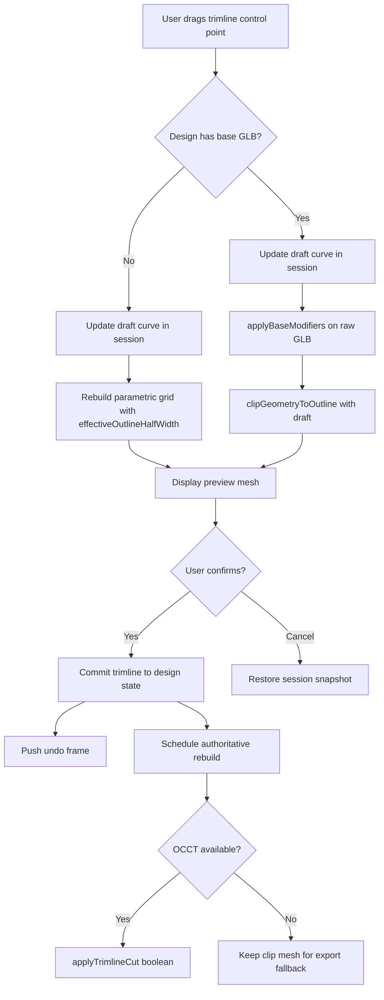

# Orthotic Insole CAD — System Architecture

**Status:** Architecture specification (v2.0)  
**Audience:** Engineering, clinical product, manufacturing  
**Platform:** Vertex (web orthotic CAD) on Chili3D (browser OCCT B-rep kernel)  
**Changelog:** v2.0 strengthens trimline editing on bases, displacement/boolean decision framework, undo/redo design, clinical constraints layer, GLB base long-term vision, and unified user mental model.

This document defines the target architecture for a modern web-based orthotic insole CAD system that replaces legacy Rhino workflows. It unifies **direct / freeform editing** and **automated clinical corrections** on the same geometry, producing watertight output suitable for 3D printing and CNC milling.

Related implementation docs:

- [`hybrid-geometry-architecture.md`](./hybrid-geometry-architecture.md) — dual preview / authoritative pipelines
- [`base-modifier-architecture.md`](./base-modifier-architecture.md) — Base + Modifier model

---

## 1. Executive Summary

The system is organized as a **layered, non-destructive design graph** with a single canonical parametric definition at its center. All clinical intent — corrections, trimline, elements, thickness, production method — lives in serializable **design state**. Geometry is never the source of truth; it is always **derived**.

Two geometry tiers serve two UX needs:

| Tier | Engine | When | Output |
|------|--------|------|--------|
| **Preview** | Procedural mesh + displacement + clip | Every interaction frame | Fast, visually faithful, approximate topology |
| **Authoritative** | OpenCascade (OCCT) WASM B-rep | Idle debounce, Confirm, Export | Watertight solid, exact booleans, manufacturing validation |

Direct editing (trimline drag, element move) and automated corrections (arch raise, posting wedge) both mutate the same design state. The shared **height field** (`heightAt`) ensures preview and authoritative geometry stay clinically aligned.

**v2.0 architectural commitments:**

1. **Trimline editing uses a hybrid clip + boolean model** — never freeform vertex sculpting of the perimeter.
2. **Displacement vs boolean is decided by operator metadata**, not ad hoc per feature.
3. **Undo/redo is a Phase 3A requirement**, not deferred to Phase 4.
4. **Clinical constraints live in a dedicated validation layer** with operator-level defaults.
5. **Loaded GLB bases evolve through four integration stages** from mesh displacement to sewn multi-body B-rep.

---

## 2. Overall System Architecture

```
┌─────────────────────────────────────────────────────────────────────────────────┐
│                              PRESENTATION LAYER                                  │
│  R3F Viewer · TrimlineEditTools · MeshEditTools · Correction panels · Export UI │
└───────────────────────────────────┬─────────────────────────────────────────────┘
                                    │ commands / gestures
                                    ▼
┌─────────────────────────────────────────────────────────────────────────────────┐
│                           INTERACTION & COMMAND LAYER                            │
│  Edit sessions · Correction sliders · Undo/Redo stack · Clinical guardrails      │
│  validate(clinical) → patch design state → schedule geometry rebuild             │
└───────────────────────────────────┬─────────────────────────────────────────────┘
                                    │ DesignPatch
                                    ▼
┌─────────────────────────────────────────────────────────────────────────────────┐
│                         DESIGN STATE (single source of truth)                    │
│  base? · corrections · trimlines · elements · thickness · method · metadata       │
│  HistoryStack (undo/redo) · persisted via Prisma / JSON export                   │
└───────────────────────────────────┬─────────────────────────────────────────────┘
                                    │ HeightFieldParams + ClinicalContext
                                    ▼
┌─────────────────────────────────────────────────────────────────────────────────┐
│                          PARAMETRIC DEFINITION LAYER                             │
│  height-field.ts  — heightAt(u, v) = baseline + corrections + elements          │
│  trimline.ts      — outline half-width, perimeter curve, clip, boolean prism     │
│  elements.ts      — placed additive/subtractive features                         │
│  clinical-constraints.ts — safe ranges, STA defaults, feathering rules (new)     │
└───────────────┬─────────────────────────────────────────────┬─────────────────────┘
                │                                             │
                ▼                                             ▼
┌───────────────────────────────┐           ┌───────────────────────────────────┐
│   PREVIEW GEOMETRY LAYER       │           │   AUTHORITATIVE GEOMETRY LAYER     │
│   ThreeKernel (tier=preview)   │           │   OcctKernel (tier=authoritative)  │
│   · buildInsoleGeometry()      │           │   · buildOcctInsoleSolid()         │
│   · applyBaseModifiers()       │           │   · base-modifier-booleans.ts      │
│   · clipGeometryToOutline()    │           │   · occt.worker.ts                 │
│   · geometry.worker.ts         │           │                                    │
│   Target: < 16 ms / rebuild    │           │   Target: watertight BRep solid    │
└───────────────┬───────────────┘           └─────────────────┬─────────────────┘
                │                                             │
                └────────────────────┬────────────────────────┘
                                     ▼
┌─────────────────────────────────────────────────────────────────────────────────┐
│                           MANUFACTURING & EXPORT LAYER                           │
│  Clinical re-validation · Solid repair · STL / GLB / G-code                      │
└─────────────────────────────────────────────────────────────────────────────────┘
```

### Unified user mental model

From the clinician's perspective there is **one insole** and **one set of tools**. Trimline reshape, arch raise, met pad placement, and posting wedge are all **modifications** to the same design — not separate "manual mode" vs "parametric mode." The UI may group tools by category (Outline, Corrections, Elements) but the architecture treats every action identically:

```
User gesture → Command → Clinical validate → Design patch → Geometry rebuild
```

The only internal distinction is **how each modification type is evaluated onto geometry** (field displacement, outline clip, or boolean) — which is invisible to the user unless validation surfaces a warning.

---

## 3. Geometry Representation Strategy

### 3.1 Design primitives (what we store)

| Primitive | Representation | Connected to 3D mesh via |
|-----------|----------------|--------------------------|
| **Base template** | GLB asset reference (`DesignBase`) or absent (full parametric) | Displacement field on base vertices; long-term: sewn OCCT solid |
| **Trimline / outline** | Closed polyline `TrimlinePoint[]` per side, footprint mm coords | Width envelope + clip (preview) + boolean prism (authoritative) |
| **Corrections** | Typed scalars in `SideCorrections` | Evaluated inside `heightAt(u, v)` |
| **Elements** | `PlacedElement[]` with kind, pose, scale, height | `elementHeightAt()` in height field; OCCT fuse/cut on export |
| **Thickness / method** | `thicknessMm`, `ProductionMethod` | Shell offset, bottom plane, printing_shell hollow |

Nothing in the mesh is authoritative. The mesh is always **recomputable** from design state.

### 3.2 Runtime geometry representations

| Representation | Use | Strengths | Limitations |
|----------------|-----|-----------|-------------|
| **Height field** `z = f(u, v)` | Shared clinical definition | Single source for corrections; fast sampling | Not topology-aware |
| **Displacement field** `Δz = f(u,v) − f_neutral(u,v)` | Base + Modifier path | Preserves base intrinsic detail; bottom-stable | Requires orientation classification |
| **Outline clip** | Base-mode trimline preview | Immediate visual feedback; O(triangles) | Open boundary; not manufacturing-grade |
| **Width envelope** | Parametric-mode trimline preview | Rebuilds clean grid boundary | Approximates complex trimline curves |
| **OCCT B-rep solid** | Confirm / export | Exact topology; booleans; `isClosed()` | Heavy; async |

### 3.3 Base vs parametric modes

| Mode | Trigger | Geometry path |
|------|---------|---------------|
| **Parametric** | No `design.base` | Full generation: height field → grid mesh / OCCT loft |
| **Base + Modifier** | `design.base` references GLB | `delta(u,v)` displacement on base; trimline clip; OCCT booleans on confirm |

Both modes share identical correction / trimline / element parameters. Only the **application strategy** differs.

---

## 4. Direct Trimline / Outline Editing

This section defines exactly how trimline manipulation affects visible geometry in real time, and how preview differs from authoritative output.

### 4.1 Core principle: trimline is a boundary operator, not a sculpt brush

Trimline editing **never** moves individual mesh vertices along the perimeter. The trimline is stored as a **closed 2D curve** in footprint coordinates `(x_length, y_width)`. Geometry responds through one of two mechanisms depending on mode:

| Mode | Preview mechanism | Authoritative mechanism |
|------|-------------------|-------------------------|
| **Parametric** | Rebuild mesh with `effectiveOutlineHalfWidth(u)` from trimline | OCCT loft bounded by trimline stations + optional `applyTrimlineCut` boolean |
| **Loaded GLB base** | `applyBaseModifiers` then `clipGeometryToOutline` | Sew base → B-rep → `applyTrimlineCut` boolean (Phase 3) |

**Why not deform?** Perimeter sculpting (moving boundary vertices) would bake topology into the mesh, break undo, and destroy the neutral base template. **Why not boolean during drag?** OCCT booleans are too slow for 60 fps interaction. **Why hybrid clip + boolean?** Clip gives instant visual truth on bases; boolean gives manufacturing truth on export.

### 4.2 Trimline edit pipeline (both modes)

```
┌──────────────┐     beginTrimlineEdit()      ┌─────────────────────┐
│  Committed   │ ───────────────────────────► │  Edit session       │
│  trimline    │     snapshot + draft clone   │  draft curve (live) │
│  in design   │                              │  isDragging flag    │
└──────────────┘                              └──────────┬──────────┘
                                                         │ drag frames
                                                         ▼
                                              ┌─────────────────────┐
                                              │  Preview rebuild    │
                                              │  (draft trimline)   │
                                              └──────────┬──────────┘
                                                         │ confirmTrimlineEdit()
                                                         ▼
                                              ┌─────────────────────┐
                                              │  Commit to design   │
                                              │  + undo frame push  │
                                              └─────────────────────┘
```

**Session state** (`TrimlineEditSession` in `mesh-edit-store.ts`):

- `draft` — live curve during edit; drives preview
- `snapshot` — curve at session start; restored on cancel
- `dragAnchorIndex` + Gaussian falloff — local smooth deformation of control points (curve edits only, not mesh)

**Control point deformation** (`deformTrimlineSection`) applies Gaussian falloff along the polyline so dragging one point does not create kinks. This is **curve smoothing**, not surface sculpting.

### 4.3 Parametric mode: width-envelope rebuild

When no base GLB is loaded, the procedural mesher (`buildInsoleGeometry`) samples the top surface on a structured grid. At each longitudinal station `u`:

```
halfWidth(u) = effectiveOutlineHalfWidth(u, L, W, trimline)
```

For each grid row, `v_signed ∈ [-1, 1]` maps to `y = v_signed × halfWidth(u) × (W/2)`.

**During trimline drag:**

1. `InsoleMesh` passes `trimlineEdit.draft` to `useInsoleGeometry` (when not mid-drag-anchor; see §4.6).
2. Worker rebuilds grid mesh at preview quality with new width envelope.
3. Triangles outside the envelope are never created — boundary is implicit in the grid.

**On Confirm / Export (authoritative):**

1. OCCT loft uses the same `effectiveOutlineHalfWidth` for station extents.
2. Optional `useBooleanTrimline`: vertical prism from closed curve → `solid ∩ prism` for exact perimeter cut.
3. Any preview/export gap at complex curves (e.g. sharp medial notch) is closed by the boolean pass.

### 4.4 Loaded GLB base mode: displacement then clip

Base-mode trimline editing follows a **strict two-stage preview pipeline** (implemented in `useBaseInsoleGeometry.ts`):

```
raw GLB  →  applyBaseModifiers(raw, field)  →  clipGeometryToOutline(modified, trimline)  →  display
            (vertical Δz only, XY unchanged)     (drop exterior triangles by centroid test)
```

**Stage 1 — Modifier displacement (`applyBaseModifiers`):**

- Samples `correctionDeltaAt(u, v)` from the height field.
- Applies `Δz × topFactor` along the detected up axis.
- **Does not modify XY** — trimline shape is independent of correction displacement.
- Bottom vertices (topFactor ≈ 0) remain fixed — clinical base bottom is preserved.

**Stage 2 — Outline clip (`clipGeometryToOutline`):**

- Closed trimline polygon in footprint XY plane.
- Each triangle kept iff its **centroid** is inside the polygon (even-odd test).
- Polygon inflated by `marginMm` (default 1.5 mm) about centroid so an unedited auto-outline does not shave the silhouette.
- Produces a new `BufferGeometry` with an **open boundary** along the cut — acceptable for preview, not for manufacturing.

**Trimline initialization on base load:**

1. `extractMeshOutline(geo)` samples the mesh silhouette → `base-outline-store`.
2. `beginTrimlineEdit` starts from extracted outline (not parametric default).
3. User edits are relative to the **actual base boundary**.

### 4.5 Preview vs authoritative: trimline comparison

| Aspect | Preview (interactive) | Authoritative (idle / export) |
|--------|----------------------|-------------------------------|
| **Parametric** | Grid rebuild via width function | Loft + boolean prism cut |
| **Base GLB** | Centroid clip after displacement | B-rep sew + boolean prism cut (Phase 3) |
| **Boundary quality** | Open / jagged cut mesh | Watertight vertical side walls |
| **Corrections at edge** | Feathered via `edgeFeather` in height field | Same field + exact perimeter |
| **Performance** | < 16 ms target | 0.3–10 s |
| **Watertight** | No | Required (`isClosed()`) |

### 4.6 Known gap and required fix (implementation)

**Current behavior:** `useBaseInsoleGeometry` clips against the **committed** trimline only. During an active `trimlineEdit` session, the base mesh does not update until `confirmTrimlineEdit()`.

**Required behavior (Phase 3A):**

```typescript
const activeTrimline =
    trimlineEdit?.side === side
        ? trimlineEdit.draft
        : getDesignTrimline(design, side);
if (activeTrimline) display = clipGeometryToOutline(modified, activeTrimline);
```

This aligns base-mode live trimline feedback with parametric mode (which already passes draft to `useInsoleGeometry`).

### 4.7 Edge feathering during trimline manipulation

Edge feathering operates in **two independent layers** that must not be conflated:

**Layer A — Correction edge feather (height field):**

```typescript
edgeFeather = smoothstep(1.0, 0.86, av)   // av = |v_signed|, normalized width
shaped *= 0.35 + 0.65 * edgeFeather
```

- Additive corrections (arch, cup, flanges, elements) taper toward the **normalized width edge** (`av → 1`).
- When trimline moves inward, `effectiveOutlineHalfWidth` shrinks → the same physical point may have a lower `av` → **more feathering** → natural thinning at a narrower perimeter.
- **Posting tilt is excluded** from feathering — it must remain full-strength at the medial/lateral edges of the current outline.

**Layer B — Trimline clip boundary (base preview):**

- Clip produces a hard triangle drop at the polygon — no feather at the geometric cut.
- Visual smoothness at the cut edge comes from mesh density and optional **rim blend zone** (recommended Phase 3B):

```
rimBlend(u, v) = smoothstep(0, RIM_BLEND_MM, signedDistanceToTrimline(v))
displayHeight *= rimBlend   // only in a narrow band inside the trimline
```

- `RIM_BLEND_MM` ≈ 1.5–2.5 mm — prevents a visibly "stair-stepped" clip edge on coarse base meshes.

**Clinical blending zone (corrections near trimline):**

When the user pulls the trimline inward under an arch dome or heel cup:

1. Corrections remain active — `heightAt` still evaluates at all interior points.
2. Points near the new edge have lower `edgeFeather` weight → dome thins naturally at the perimeter.
3. Posting at the heel edge re-evaluates at the new medial/lateral extents.
4. Elements whose centroid falls outside the new trimline → **orphan warning** (see §10).

### 4.8 Trimline editing decision diagram



---

## 5. Displacement vs Boolean Decision Framework

### 5.1 Decision principles

Every modification operator carries metadata:

```typescript
interface OperatorGeometryPolicy {
    /** Contributes to heightAt / displacement field. */
    field: boolean;
    /** Preview-only mesh clip (trimline on base). */
    clip?: boolean;
    /** OCCT boolean on authoritative path. */
    boolean?: boolean;
    /** Reason code for logging and UI tooltips. */
    reason: "continuous_surface" | "topology_change" | "exact_volume" | "sharp_edge";
}
```

**Global rules:**

| Rule | Statement |
|------|-----------|
| **R1** | If the modification is a **continuous surface change** on an existing manifold, use **field / displacement** in preview and authoritative. |
| **R2** | If the modification **changes topology** (genus, boundary loop, footprint area), use **clip in preview** and **boolean in authoritative**. |
| **R3** | If the modification requires **exact volume** for milling accountability, use field in preview and **boolean fuse/cut** in authoritative. |
| **R4** | If the modification requires a **sharp clinical edge** (skive, deep cut), use field approximation in preview and **boolean** in authoritative. |
| **R5** | **Never** run OCCT booleans during active drag. Schedule on idle debounce, Confirm, or Export. |
| **R6** | Booleans **fail soft** — on error, keep the last valid solid (deformation-only result). |
| **R7** | Preview must be **monotonic** with authoritative: preview should never show a correction that authoritative would remove, and vice versa for enabled operators. |

### 5.2 Operator policy table

| Operator | Preview | Authoritative | Policy reason |
|----------|---------|---------------|---------------|
| **Arch height / fill** | Field (`heightAt`) | Field in loft | R1 — continuous dome |
| **Arch apex shift** | Field (`apexCenter`) | Field in loft | R1 — longitudinal shift of bump |
| **Heel cup height** | Field | Field in loft | R1 — smooth rim raise |
| **Heel cup depth** | Field | Field in loft | R1 — smooth centre relief |
| **Rearfoot posting (deg)** | Field (planar tilt) | Field in loft | R1 — continuous incline |
| **Rearfoot posting (mm wedge)** | Field (medial taper) | Field + optional boolean wedge if > 4 mm | R1 + R4 for large posts |
| **Forefoot posting (deg)** | Field | Field in loft | R1 |
| **Supination wedge (mm)** | Field (`medialBlend` taper) | Field; boolean if steep (> 6 mm over < 25 mm width) | R1 default; R4 if slope > 14° |
| **Pronation wedge (mm)** | Field (lateral taper) | Same as supination | R1 / R4 |
| **Medial / lateral skive** | Field subtract | Boolean box wedge (`applySkives`) | R4 — sharp heel shelf |
| **Medial / lateral flange** | Field | Field in loft | R1 — wall raise |
| **Met pad / bar (additive)** | Field bump | Boolean fuse (`applyElements`) | R3 — exact pad volume |
| **Heel / navicular sink** | Field subtract | Boolean cut | R3 + R4 |
| **Kinetic / reverse Morton's** | Field subtract | Boolean cut | R3 + R4 |
| **Cluffy / Morton's extension** | Field bump | Boolean fuse | R3 |
| **Trimline / outline** | Width envelope or clip | Boolean prism cut | R2 — topology change |
| **Thickness** | Field (`thicknessMm`) | Shell offset / bottom plane | R1 |
| **Custom GLB element** | Field approx or proxy bump | Boolean fuse/cut of imported mesh | R3 |

### 5.3 Tier transition points

```
┌─────────────────────────────────────────────────────────────────────────┐
│                        INTERACTION TIMELINE                              │
├──────────────┬──────────────────────┬───────────────────────────────────┤
│ Phase        │ Geometry tier        │ Operators applied                  │
├──────────────┼──────────────────────┼───────────────────────────────────┤
│ Drag frame   │ Preview              │ Field + clip only (R5)            │
│ Slider scrub │ Preview              │ Field only (live patch)           │
│ Slider release│ Preview (full grid) │ Field only                        │
│ Idle 300ms   │ Authoritative start  │ Field in loft + booleans queued   │
│ Idle 3s      │ Authoritative done   │ All R2–R4 booleans applied        │
│ Confirm      │ Authoritative freeze │ Full pipeline + validation        │
│ Export       │ Authoritative bake   │ Full pipeline + export gates      │
└──────────────┴──────────────────────┴───────────────────────────────────┘
```

### 5.4 Maintaining visual consistency across tiers

**Problem:** A met pad looks like a smooth bump in preview but a faceted boolean fuse in authoritative.

**Mitigations:**

1. **Shared height field** — pad location, size, and amplitude are identical; only the geometric realization differs.
2. **Idle authoritative overlay** — after debounce, show a subtle "validated" indicator when OCCT build completes; optional ghost mesh diff if boolean changed volume > 2%.
3. **Element bump profiles** — use the same `ELEMENT_PROFILES` radii for field and boolean primitive sizing.
4. **Trimline** — show the trimline curve overlay in both tiers; boolean cut should match the curve within 0.1 mm (tessellation tolerance).

### 5.5 Posting wedge: field vs boolean worked example

**Clinical request:** 4 mm medial rearfoot supination wedge, 0 mm lateral.

**Preview (field path):**

```
heel_env = bump(u; 0.1, 0.18)
medial_w = medialBlend × smoothstep(0.1, 0.85, av)
Δz = 4.0 × heel_env × medial_w
```

**Authoritative (field path, default):**

Same `heightAt` evaluation in loft cross-sections — sufficient for slopes ≤ ~12°.

**Authoritative (boolean path, when triggered):**

Condition: `wedge_mm ≥ 4 && wedge_width < 30 mm` (steep slope).

```
buildSkiveWedge(factory, { side: "medial", depthMm: 4, ... })
solid = booleanCut(solid, wedge)
```

The boolean runs **after** the lofted field-based solid is built, refining the heel shelf to a planar cut surface suitable for CNC.

---

## 6. Undo / Redo and Edit Session Design

Undo/redo is a **Phase 3A requirement** — clinical CAD without undo is not production-viable.

### 6.1 Architecture

```
┌─────────────────────────────────────────────────────────────┐
│  HistoryStore (Zustand, alongside design-store)              │
│  ┌─────────────────────────────────────────────────────┐    │
│  │ frames: DesignSnapshot[]    maxFrames: 50          │    │
│  │ index: number               (0 = oldest retained)   │    │
│  └─────────────────────────────────────────────────────┘    │
│  pushSnapshot(state) · undo() · redo() · canUndo · canRedo   │
└─────────────────────────────────────────────────────────────┘
```

```typescript
type DesignSnapshot = Readonly<DesignState>;

interface HistoryStore {
    frames: DesignSnapshot[];
    index: number;           // points to current frame
    pushSnapshot(state: DesignState): void;
    undo(): DesignState | null;
    redo(): DesignState | null;
}
```

**Snapshot strategy:**

- `structuredClone(design)` — DesignState is JSON-serializable; no mesh data in snapshots.
- Typical snapshot size: < 10 KB — 50 frames ≈ 500 KB memory.
- **Do not snapshot geometry** — rebuild from state on undo/redo.

### 6.2 Granularity rules

| User action | Undo behavior |
|-------------|---------------|
| Trimline drag (in progress) | No frame — session only |
| Trimline confirm | **One frame** (before → after) |
| Trimline cancel | No frame — restore session snapshot |
| Correction slider scrub | No frame — live preview only |
| Correction slider release | **One frame** (value before scrub → after) |
| Element place / move commit | **One frame** per commit |
| Element delete | **One frame** |
| AI prescription apply (batch) | **One frame** for entire batch |
| Base template change | **One frame** |
| Thickness change (release) | **One frame** |
| Linked L/R mirror toggle | **One frame** |

### 6.3 Edit session integration with undo stack

```
beginTrimlineEdit(side):
    session.snapshot = clone(committedTrimline)   // local revert
    // Do NOT push undo frame yet

confirmTrimlineEdit():
    before = history.frames[history.index]        // current design
    apply trimline patch to design
    history.pushSnapshot(before)                  // undo restores pre-edit trimline
    clear session

cancelTrimlineEdit():
    // design unchanged — no undo frame needed
    clear session

undo() during active session:
    cancel session first (implicit cancel)
    restore previous frame
```

**Rule:** Only one active edit session at a time. Starting a new session while another is open → auto-cancel the previous (with confirmation if draft is dirty).

### 6.4 Non-destructive corrections and undo

Corrections are **scalar fields in design state**, not baked mesh changes. Undo restores the entire `DesignState` including all correction values, trimlines, and elements. There is no "baked correction" layer to conflict with undo.

**Coalescing (optional optimization):**

For rapid slider micro-adjustments, coalesce frames within 300 ms window into a single undo step. Implementation: on `pushSnapshot`, if `Date.now() - lastPush < 300ms` and same field key, replace `frames[index]` instead of appending.

### 6.5 Performance on undo/redo

```
undo():
    design = frames[index - 1]
    designStore.set(design)
    geometryEngine.cancelStaleBuilds()
    schedulePreviewRebuild()
    scheduleAuthoritativeRebuild(debounce=500ms)
```

- Undo/redo is O(1) state restore + O(rebuild) geometry.
- Preview rebuild is mandatory and immediate.
- Authoritative rebuild is debounced — do not block UI.

### 6.6 Keyboard / UX contract

- `Ctrl+Z` / `Ctrl+Y` — global undo/redo
- Undo available for all committed actions
- Trimline drag: `Escape` = cancel session; `Enter` = confirm
- History indicator: "Step 12 of 12" in status bar (optional)

---

## 7. Clinical Constraints and Intelligence Layer

### 7.1 Layer placement

Clinical knowledge is split across **three tiers** (not embedded only in UI):

```
┌─────────────────────────────────────────────────────────────┐
│  Tier 1: clinical-constraints.ts (domain constants)          │
│  Safe ranges, default feathering, STA parameters, min wall   │
└──────────────────────────┬──────────────────────────────────┘
                           │ imported by
┌──────────────────────────▼──────────────────────────────────┐
│  Tier 2: Operator definitions (height-field, elements)       │
│  Each operator declares ClinicalSpec: range, default, blend   │
└──────────────────────────┬──────────────────────────────────┘
                           │ validated by
┌──────────────────────────▼──────────────────────────────────┐
│  Tier 3: Command / export gates (interaction layer)          │
│  Soft warn in UI · hard block on export · expert bypass flag   │
└─────────────────────────────────────────────────────────────┘
```

**Why three tiers?** Constants change with evidence updates (Tier 1). Operator math changes with geometry (Tier 2). Enforcement policy changes with product mode (Tier 3).

### 7.2 Clinical constraint catalog (initial)

```typescript
// vertex/src/lib/clinical/constraints.ts (proposed)

export const CLINICAL_LIMITS = {
  rearfootPostingDeg:  { min: -8, max: 8,  default: 0, warn: 6 },
  forefootPostingDeg:  { min: -6, max: 6,  default: 0, warn: 4 },
  rearfootWedgeMm:     { min: 0,  max: 8,  default: 0, warn: 6 },
  archHeightMm:        { min: -5, max: 15, default: 0, warn: 12 },
  archFillMm:          { min: 0,  max: 10, default: 0, warn: 8 },
  apexMoveMm:          { min: -25, max: 25, default: 0, warn: 20 },
  heelCupDepthMm:      { min: 0,  max: 8,  default: 0, warn: 6 },
  medialSkiveMm:       { min: 0,  max: 6,  default: 0, warn: 4 },
  elementHeightMm:     { min: 0.5, max: 12, default: 3, warn: 8 },
  minWallThicknessMm:  0.8,
  rimBlendMm:          2.0,
} as const;
```

### 7.3 Biomechanical rules (embedded in operators)

**Rearfoot posting and subtalar joint (STA):**

- Default: planar posting tilt about medial-lateral axis (current `heightAt` implementation).
- STA-aware mode (Phase 4): posting rotates about an axis from calcaneal contact (~15% length) to navicular (~45% length, ~25% width medial).
- STA influence zone: `u < 0.35` — posting outside this zone is attenuated by `smoothstep(0.35, 0.25, u)`.

**Arch apex movement:**

- Apex should remain in midfoot load-bearing zone: `u ∈ [0.30, 0.55]` after shift.
- Constraint: `0.42 + apexMoveMm/L ∈ [0.30, 0.55]` — warn if violated.

**Supination / pronation wedge taper:**

- Medial-to-lateral transition must span ≥ 60% of heel width (no step edges).
- Enforced by `smoothstep(0.1, 0.85, av)` minimum span — not configurable below 0.6 without expert flag.

**Edge feathering:**

- Additive corrections: `edgeFeather` at `av > 0.86` — fixed clinical constant.
- Posting: **never feathered** — full strength at perimeter.
- Rationale: posting must be measurable at the heel seat interface; feathering would under-correct.

**Tissue stress heuristic (advisory, Phase 4):**

- Flag if `archHeightMm + heelCupHeightMm > 18 mm` in the same midfoot zone (potential focal peak pressure).
- Flag if net skive + posting creates > 10° effective heel surface slope.

### 7.4 Expert mode vs guardrails

```typescript
interface UserPreferences {
    expertMode: boolean;   // bypass soft warnings, not hard export minimums
}
```

| Constraint type | Default user | Expert mode | Export |
|-----------------|-------------|-------------|--------|
| Out of recommended range | Soft warn (amber) | Silent | Allow with log |
| Out of hard limit | Clamp or block slider | Allow slider | **Block** with message |
| Below min wall thickness | Auto floor via `softFloor` | Same | **Block** |
| Orphan element outside trimline | Warn | Warn | **Block** unless repositioned |

### 7.5 AI prescription integration

AI-parsed prescriptions pass through the same `clinical-constraints.ts` validator before applying:

```
AI output → parse → validateAndClamp(patch) → preview → user accept → pushSnapshot
```

Clamped values include a `wasClamped: true` flag for transparency in the UI.

---

## 8. Loaded GLB Base Integration (Long-Term Vision)

### 8.1 Base asset anatomy

Clinical bases from Rhino labs are typically exported as:

```
GLB
├── Top mesh     — contoured footbed surface (high detail)
├── Bottom mesh  — plantar surface (must remain stable)
└── (optional) Side walls / shell
```

**Design rule:** Bases must be **neutral** — no corrections baked in. The system applies all clinical changes as modifiers.

### 8.2 Four-stage integration evolution

```
Stage 0 (current)     Stage 1 (Phase 3A)      Stage 2 (Phase 3B)       Stage 3 (Phase 4)
─────────────────     ──────────────────      ──────────────────       ─────────────────
Single merged mesh    Top/bottom tagged       Sewn OCCT solid          Parametric regions
Displacement Δz       Clip + displacement     Boolean modifiers        Blend weights
Preview clip          Draft trimline live     Exact trimline cut       Arch-only on base
No OCCT on base       Validation gates        Shell offset on base     Scan registration
```

### 8.3 Stage 0 — Current (displacement + clip)

**What happens today:**

1. GLB loaded as single `BufferGeometry` (top + bottom merged or top-only).
2. `classifyBaseTopFactors` identifies top vs bottom vertices by normal direction.
3. Corrections applied as vertical displacement weighted by top factor.
4. Committed trimline clips mesh by centroid test.
5. Export: `buildFromBase` with deformation + smoothing; OCCT booleans on parametric loft path only.

**Detail preservation:**

```
δ(u,v) = heightAt(corrected) − heightAt(neutral)
z' = z_base + δ × topFactor(v)
```

The base's intrinsic surface detail (carves, texture, subtle curves) lives in `z_base` and is **never overwritten** — only vertically offset. This is the critical guarantee for loaded Rhino templates.

### 8.4 Stage 1 — Multi-mesh awareness (Phase 3A)

```typescript
interface ParsedBaseAsset {
    top: BufferGeometry;
    bottom: BufferGeometry;
    walls?: BufferGeometry;
    axes: BaseAxes;           // detected orientation
    outline: TrimlineCurve;   // from extractMeshOutline(top)
}
```

- Load GLB scenes; identify top/bottom by name heuristic (`top`, `bottom`, `footbed`) or by normal classification.
- Displacement applied to **top mesh only**; bottom mesh passed through unchanged.
- Side walls: stretch vertically with top displacement at boundary (blend topFactor on wall vertices).

### 8.5 Stage 2 — Sewn OCCT solid (Phase 3B)

```
buildFromBase(base, field):
  1. Tessellate top + bottom → faces
  2. Sew into shell (OCCT BRepBuilderAPI_Sewing)
  3. Apply displacement as surface deformation field on top faces
     OR rebuild top from height field sampling (higher quality, loses micro-detail)
  4. applyTrimlineCut → applyElements → applySkives
  5. Shell offset if printing_shell
  6. repairOcctSolid → validate
```

**Detail vs accuracy trade-off:**

| Strategy | Preserves base micro-detail | Watertight | Boolean-ready |
|----------|----------------------------|------------|---------------|
| Displace sewn B-rep vertices | Yes | After repair | Moderate |
| Rebuild top from height field | No | Yes | Excellent |
| **Hybrid (recommended)** | Partial | Yes | Excellent |

**Hybrid:** Rebuild top surface from `heightAt` in the correction zones (arch, heel cup, posting); preserve `z_base` elsewhere via blended mask:

```
z_top = mask_correction × heightAt(u,v) + (1 − mask_correction) × (z_base + δ_minimal)
```

### 8.6 Stage 3 — Regional blend weights (Phase 4)

Allow modifiers to be scoped:

```typescript
interface RegionalModifierMask {
    arch: number;      // 0 = preserve base, 1 = full correction
    heelCup: number;
    posting: number;
    forefoot: number;
}
```

Enables: "raise arch on this base but leave the forefoot template untouched."

### 8.7 Direct editing on loaded bases — unified rules

| Edit type | Effect on base detail | Bottom preserved |
|-----------|----------------------|------------------|
| Arch raise | Top surface domes via δ field | Yes |
| Trimline inward | Clip removes perimeter triangles | Yes (bottom unchanged) |
| Trimline outward | Cannot add material beyond base — **warn user** | Yes |
| Element pad | Bump on top surface | Yes |
| Thickness increase | Top lifts via thickness delta | Yes (bottom anchored) |
| Skive | Field subtract on top; boolean on export | Yes |

**Trimline outward expansion:** A loaded base has finite extent. Moving the trimline outside the base silhouette cannot create material. Preview shows the request; UI warns: *"Outline extends beyond base — switch to parametric mode or enlarge base template."*

---

## 9. Direct Editing ↔ Automated Corrections — Interaction Rules

### 9.1 Unified interaction model

| Principle | Rule |
|-----------|------|
| **Single state** | All edits patch `DesignState` — no parallel "manual layer" |
| **Commutativity (approximate)** | Applying correction A then editing trimline ≈ editing trimline then applying A, evaluated at final state |
| **No invalidation** | Trimline edit does not reset corrections; correction edit does not reset trimline |
| **Re-evaluation** | All operators always read **current** state at rebuild time |
| **Orphan detection** | Elements outside current trimline are flagged, not silently dropped |

### 9.2 Scenario matrix

| Sequence | Result |
|----------|--------|
| Raise arch 3 mm → shrink trimline | Arch dome active within smaller footprint; edge feathers at new boundary |
| Shrink trimline → raise arch 3 mm | Same final state as above |
| Place met pad → move trimline inward past pad | Pad becomes orphan → warn; export blocked until resolved |
| 4° rearfoot post → edit heel trimline | Posting re-evaluates at new medial/lateral edge positions |
| Load new base template | Corrections preserved; trimline reset to `extractMeshOutline(newBase)` — **one undo frame** |
| Apex shift 10 mm distal → arch height +5 mm | Independent operators; both active in `heightAt` |

### 9.3 Clinical intent preservation

**Intent** is the set of enabled correction values and element placements — not the mesh shape.

When direct edits occur:

1. **Scalar corrections are never auto-adjusted** — if the user shrinks the trimline, `archHeightMm` stays at 3 mm (not auto-reduced).
2. **Advisory recalculation (Phase 4)** — optional "suggest adjusted arch fill" if trimline shrink would cause edge crowding (heuristic only; never auto-applied).
3. **Export validation** — hard checks for orphans, min wall, watertight.

### 9.4 Mode presentation (UI, not architecture)

The architecture has no "modes." The UI may show:

- **Base badge** when `design.base` is set — modifiers deform a template.
- **Parametric badge** when no base — full generation.
- **Trimline edit overlay** when session is active.

These are **indicators**, not separate pipelines.

---

## 10. Correction Operator Model (Summary)

All operators contribute to `heightAt(u, vSigned, params)` and/or OCCT boolean passes. See §5 for the complete displacement/boolean policy table.

**Key formulations** (in `height-field.ts`):

```
apex_u = 0.42 + apexMoveMm / L
arch_long = bump(u; apex_u, 0.36)
Δz_arch = (archHeightMm + archFillMm) × arch_long × archAcross

post = v_signed × medialSign × (W/2)
Δz_post = tan(rearfootPostingDeg) × post × heel_env

edgeFeather = smoothstep(1.0, 0.86, av)
shaped *= 0.35 + 0.65 × edgeFeather   // posting excluded from shaped
```

**Operator interaction:**

| Interaction | Resolution |
|-------------|------------|
| Arch + heel cup overlap | Sum in `shaped`; longitudinal cross-fade |
| Posting + skive | Algebraic sum in field; boolean skive on export |
| Element on arch dome | Sum in field; boolean fuse on export |
| Medial skive + medial flange | Algebraic sum; warn if net < 0 |

---

## 11. Data Model & State Management

### 11.1 Canonical design state

```typescript
interface DesignState {
    pattern: ScanPattern;
    base?: DesignBase;
    method: ProductionMethod;
    thicknessMm: number;
    corrections: Corrections;
    elements: PlacedElement[];
    trimlines?: DesignTrimlines;
}
```

### 11.2 Future operator graph

```typescript
interface CorrectionOperator {
    id: string;
    kind: OperatorKind;
    enabled: boolean;
    params: Record<string, number>;
    region?: InfluenceRegion;
    policy: OperatorGeometryPolicy;
}
```

`SideCorrections` compiles to a fixed operator list today — migration is additive.

### 11.3 Versioning & audit

- **Design versions** — immutable snapshot on Confirm.
- **Export records** — STL hash linked to design version + kernel tier.
- **AI prescriptions** — proposed patch → user accept → one undo frame.

---

## 12. Performance & UX

### 12.1 Tiered rebuild schedule

| Trigger | Quality | Kernel | Budget |
|---------|---------|--------|--------|
| Trimline drag | preview, reduced | Three / clip | < 16 ms |
| Slider scrub | preview + patch | Three | < 16 ms |
| Slider release | preview full | Three | < 50 ms |
| Idle 300–500 ms | authoritative start | OCCT worker | < 3 s |
| Confirm / Export | authoritative + booleans | OCCT worker | < 10 s |

### 12.2 UX contracts

- Viewport **never blocks** on OCCT during drag.
- Base trimline drag shows **draft clip** (after Phase 3A fix).
- Idle authoritative build shows validation status.
- Export prefers OCCT; procedural fallback with warning.

---

## 13. Manufacturability

### 13.1 Watertight solid pipeline

```
buildOcctInsoleSolid() / buildFromBase():
  1. Build base solid (loft or sewn GLB)
  2. applySkives → applyElements → applyTrimlineCut (soft-fail each)
  3. Shell offset if printing_shell
  4. repairOcctSolid → isClosed()
  5. Tessellate → STL
```

### 13.2 Export validation gates

| Check | Threshold | Action |
|-------|-----------|--------|
| OCCT `isClosed()` | pass | Block if fail |
| `maxBottomDeltaMm` (base) | < 0.05 mm | Warn |
| Min wall thickness | ≥ 0.8 mm | Block |
| Orphan elements | none | Block |
| Clinical hard limits | in range | Block (expert: log only) |
| Posting slope | < 14° or boolean | Warn |

---

## 14. Key Technical Decisions & Trade-offs

| Decision | Choice | Trade-off |
|----------|--------|-----------|
| Trimline on base (preview) | Centroid clip | Fast; open boundary; not watertight |
| Trimline (authoritative) | Boolean prism | Exact; slow; requires OCCT |
| Trimline on parametric | Width envelope rebuild | Clean grid; approximates complex curves |
| Corrections | Height field displacement | Cannot express all shapes without booleans |
| Base detail | δ field on top factor | Preserves template; needs orientation detection |
| Booleans | Fail-soft on export | Never worse than deformation-only |
| Undo | Full design snapshots | O(rebuild) on undo; no mesh in history |
| Clinical limits | Three-tier (constants / operators / gates) | Flexible; requires maintenance |

---

## 15. Recommended Implementation Phases (Revised)

### Phase 1 — Foundation (done)

- Hybrid preview / authoritative kernels
- Shared height field, trimline editing, elements, base + modifier deformation

### Phase 2 — Clinical quality (done)

- Smooth blending, top-on-stable-bottom, OCCT booleans on parametric path, visual mode clarity

### Phase 3A — Production editing (next priority)

- [ ] **Global undo/redo** (`HistoryStore` + keyboard shortcuts)
- [ ] **Live draft trimline clip on base** (`useBaseInsoleGeometry` fix)
- [ ] **Clinical constraints module** (`clinical-constraints.ts` + UI warnings)
- [ ] Edit session ↔ undo integration (§6.3)
- [ ] Orphan element detection on trimline change

### Phase 3B — Base path parity

- [ ] Multi-mesh GLB parsing (top / bottom / walls)
- [ ] Sew base GLBs into OCCT B-rep solids
- [ ] `applyTrimlineCut` / `applyElements` / `applySkives` on `buildFromBase`
- [ ] Explicit mm posting wedge operators + boolean trigger rules
- [ ] Rim blend zone at clip boundary
- [ ] Graded thickness and shell offset on imported bases

### Phase 4 — Clinical depth

- [ ] Operator graph with enable/disable
- [ ] STA-aware rearfoot posting
- [ ] Regional blend weights on base
- [ ] Hybrid top rebuild (correction zones vs preserved base detail)
- [ ] B-spline skinned loft surface
- [ ] Curated clinical base template library
- [ ] Tissue stress advisory heuristics

### Phase 5 — Lab integration

- [ ] Scan-to-base registration
- [ ] Design version audit trail
- [ ] Batch export / belt-printer nesting
- [ ] G-code post-processor with machine profiles
- [ ] Rhino 3DM import path

---

## 16. Risks & Open Questions (Updated)

### Risks

| Risk | Impact | Mitigation |
|------|--------|------------|
| Base trimline drag not live (current gap) | User distrust during edit | Phase 3A fix — draft clip |
| Preview clip ≠ boolean cut | Export surprise | Idle authoritative preview; overlay diff |
| Clip leaves open mesh | Non-watertight preview | Acceptable for preview; OCCT on export |
| Trimline outward beyond base | Cannot add material | UI warn; suggest parametric |
| WASM failure | No authoritative solids | Procedural fallback + clear warning |
| Undo + rebuild latency | Sluggish undo on large bases | Cancel stale builds; preview only on undo |
| Clinical limits too restrictive | Expert user frustration | Expert mode bypass for soft limits |
| Multi-mesh GLB inconsistency | Wrong top/bottom assignment | Name heuristics + manual override UI |

### Open questions (refined)

1. **Trimline L/R linking** — When `corrections.linked`, should trimline edits mirror? Recommendation: **opt-in** (default off) — feet are rarely symmetric in outline.
2. **Base outward trimline** — Auto-switch to parametric extension or require new base asset? Recommendation: **warn + offer parametric forefoot extension** (Phase 4).
3. **Custom GLB elements** — Field proxy vs direct mesh boolean? Recommendation: **field in preview, mesh boolean on export** (R3).
4. **Chili3D convergence** — Adopt `IDocument`/`History`? Recommendation: **remain domain-specific**; borrow patterns, not full document tree.
5. **Scan workflow** — Scan as overlay vs scan-to-displacement-base? Recommendation: **overlay in Phase 5**; displacement base requires registration confidence score.
6. **Coalesced undo for sliders** — 300 ms window? Recommendation: **yes**, configurable.
7. **Posting units** — Degrees vs mm wedge as primary UI? Recommendation: **both linked** — `wedge_mm ≈ tan(deg) × halfWidth` in heel zone; mm is manufacturing truth, degrees is clinical convention.

---

## 17. Summary

The v2.0 architecture makes the hard decisions explicit:

1. **Trimline editing** is a boundary operator using **width-envelope rebuild** (parametric) or **displacement-then-clip** (base) in preview, and **boolean prism cut** in authoritative — never perimeter vertex sculpting.

2. **Displacement vs boolean** is governed by a **formal operator policy table** (§5) with seven global rules and clear tier transition points.

3. **Undo/redo** is a **Phase 3A requirement** with defined granularity, session integration, and snapshot strategy.

4. **Clinical constraints** live in a **three-tier system** (constants, operators, gates) balancing expert flexibility with manufacturing safety.

5. **Loaded GLB bases** evolve through **four stages** from displacement-on-merged-mesh to sewn multi-body B-rep with regional blend weights — always preserving bottom stability and top detail via the δ field.

6. **Direct editing and automated corrections** are unified through a single design state with explicit interaction rules (§9) — one tool, one insole, one undo stack.

The implementation team can proceed from this document without re-designing core behaviors for trimline editing, operator evaluation, or clinical guardrails.
